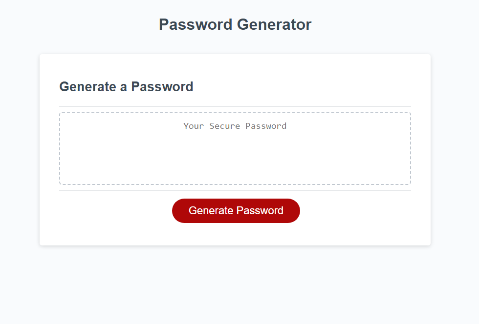
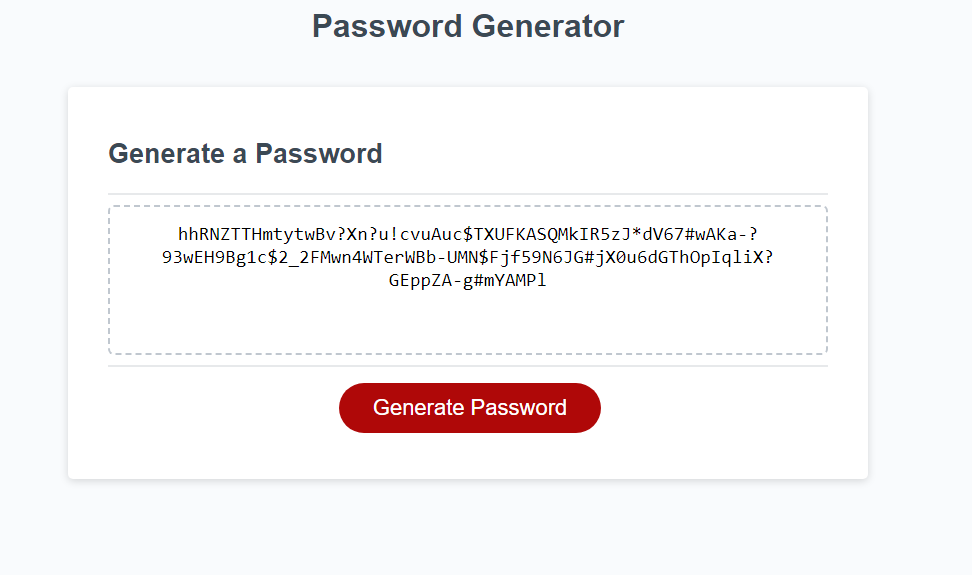

# Password Generator

## Description
Password generator with several prompts utilizing many character types for optimal security. This is created with starter code and optimized using javascript to allow the user to create random passwords. User is givin the options to include upper and lower case letters, numbers, and special characters. This tool is a perfect option for individuals with the need for complex passwords up to 128 characters to protect their files.
[Deployed Github Webpage](https://ignaciog08.github.io/password-generator/)

## Visuals

## Installation

N/A

## Usage
This generator can be used to create passwords that will be incredibly strong protecting everything you may need protected. Using JavaScript we have create a user friendly interface that will be easy to navigate.

## Credits

N/A

## License

N/A